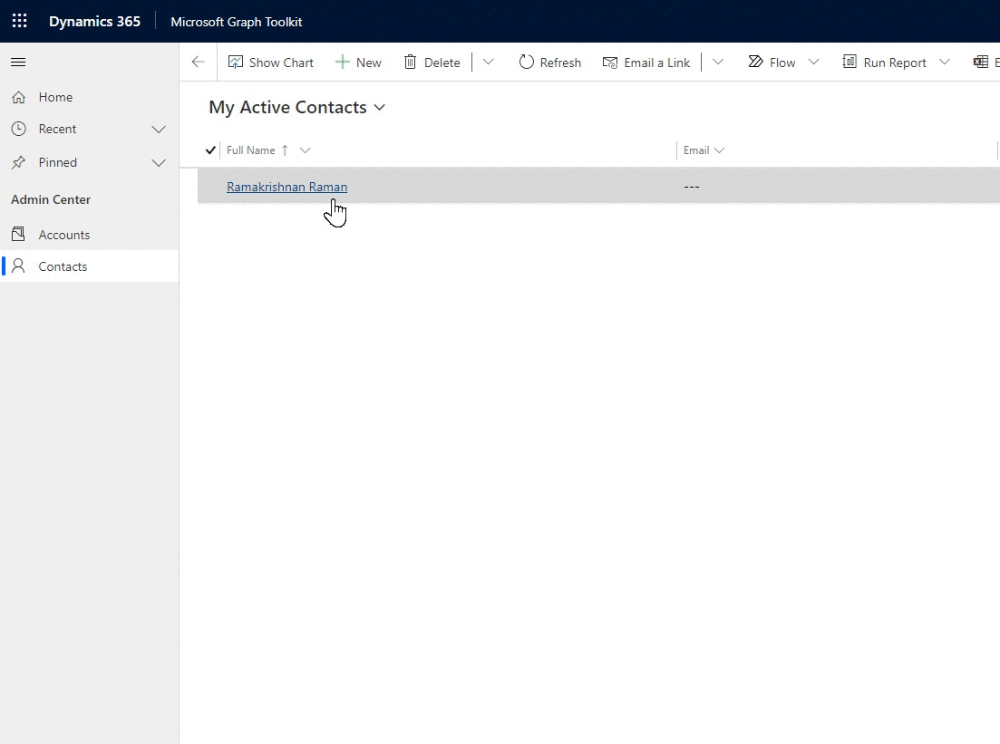

# PCF-Mgt-PeoplePicker
A PCF which uses Mgt-Peoplepicker to allow search for all users or/and groups in an organization.

If you want a peoplepicker to search on the User(systemuser) table of Dataverse instead, refer [this solution](https://github.com/Ramakrishnan24689/OfficeUIFabricReactPeoplePicker).

This control provides a seamless experience to the user who wanted to utilize Microsoft graph toolkit in Model driven powerapps with SSO experience.

Refer this [article](https://www.linkedin.com/pulse/powerapps-component-framework-microsoft-graph-toolkit-raman) for more information 

## Glimpse of this sample 

# Dependencies
 - @azure/msal-browser : https://www.npmjs.com/package/@azure/msal-browser
 - @microsoft/mgt-react : https://www.npmjs.com/package/@microsoft/mgt-react 

# Reference 

Build using this example : https://docs.microsoft.com/en-us/graph/toolkit/get-started/use-toolkit-with-react 

## Usage 

### Step 1 - Register Application in Azure AD and Grant Consent

_**Note: This step needs to be performed by Global Administrator or the person who has rights to provide consent to targeted scopes.**_

 - Login to [AAD Portal](https://aad.portal.azure.com/), headover to Apps Registeration under Azure Active Directory.
 - Create New Registeration. Provide a name, account type (Single or Multitenant, base on the need).

 

 - Specify the Redirect URIs as the Powerplatform Environment URL or the model driven app. For e.g. 'https://org839fdae6.crm.dynamics.com/'. Enable "Allow public client flows" under Advanced Settings and Save.

 - Under API permissions, Add Delegate Permission for below Microsoft Graph APIs & Grant admin consent.
- [ ] User.Read
- [ ] User.Read.All
- [ ] User.ReadBasic.All
- [ ] People.Read
- [ ] Group.Read.All

 
 

 - Make note of Client ID & Tenant ID under Overview section. This will be required in Step 3.

### Step 2 - Import the solution

  Option 1 - Import the zip file directly into Dataverse. [Managed Solution](https://github.com/Ramakrishnan24689/PCF-Mgt-PeoplePicker/blob/main/Solution/PCFMgtPeoplePickerSln.zip).

  Option 2 
  - git clone the repo
  - npm install
  - npm run build
  
 ### Step 3 - Add the component
 Create a Multiline text field and add the component.
 Update the below property before saving and publishing the component.

Property Name|Value
--------|---------
Client ID|GUID(noted in step 1)
Redirection URL ID|Environment URL(used in step 1)
Authority URL|https://login.microsoftonline.com/#TenantID# (Noted in step 1)]

## For packaging & deploying the solution, refer the below link

 https://docs.microsoft.com/en-us/powerapps/developer/component-framework/import-custom-controls 

## Solution

Solution|Author(s)
--------|---------
PCF-Mgt-PeoplePicker|Ramakrishnan Raman

## Disclaimer

**THIS CODE IS PROVIDED *AS IS* WITHOUT WARRANTY OF ANY KIND, EITHER EXPRESS OR IMPLIED, INCLUDING ANY IMPLIED WARRANTIES OF FITNESS FOR A PARTICULAR PURPOSE, MERCHANTABILITY, OR NON-INFRINGEMENT.**
